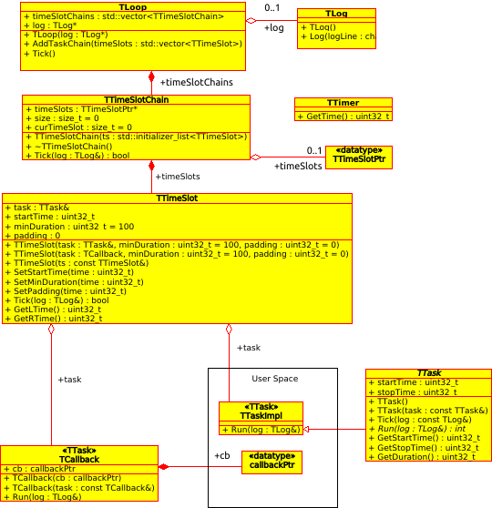

# MTLoop

## Multi Task Scheduler for Arduino

Вашему вниманию представляется мультизадачный планировщик для платформы **Arduino** - MTLoop, реализующий **кооперативную** многозадачность.

Цель разработки – создать планировщик, совместимый со всей гаммой **Arduino** подобных платформ.

## Библиотека использует следующие шаблоны программирования

### Interface
К библиотеке нужно подключать пользовательские задачи всевозможными способами. Был выделен
интерфейс **IRunnable**, которому должны удовлетворять пользовательские задачи.

### Adapter
Пользовательские задачи бывают:
* Ссылкой на функцию
* Ссылкой на IRunnable объект
* Указателем на IRunnable объект
Проблема заключается в том, что переданный указатель на IRunnable объект MTLoop должна
освобождать, для поддержания кейса:
    mtLoop.Attach({ { new MyCustomTask{} }, 100, 50 });
Тогда, как переданную ссылку на пользовательский объект или указатель на коллбек освобождать
не нужно.
Эти нюансы захотелось локализовать в одном месте, поэтому была выбрана микро-архитектура
"Адаптер", чтобы в адаптерах реализовать нюансы работы с пользовательскими тасками, а в
библиотеке использовать унифицированный интерфейс.
**IAdapter** - интерфейс адаптера
**TTskAdapter**, **TTskPtrAdapter**, **TCbAdapter**, **TCbDummyAdapter** - адаптеры

### Bridge
Если смотреть на систему **MTLoop - пользовательская задача** как на одну подсистему, то можно
выделить микро-архитектуру "Мост": **TTimeSlot** - Абстракция, агрегирующая через адаптер
**IAdapter**, реализацию (пользовательские задачи).

### Composite
**TTimeSlotChain** - класс, объединяющий в одну группу схожие объекты - пользовательские задачи
и управляющий ими.

## Нефункциональные требования

Библиотека должна

* **быть совместима со средой Arduino IDE** - библиотека расположена в папке libraries/MTLoop
* **работать на процессорах: AVR, ESP8266** - не используются шаблоны std::
* **давать возможность пользователю указывать в качестве подзадач callback функции** - класс TCallback
* **иметь специализированные средства создания подзадач** класс TTask
* **быть устойчива к исключительным ситуациям, генерируемым пользовательским кодом** - это требование оказалось невыполнимым, так как в **Arduino IDE** (avr-gcc) отключен **try/catch** из-за ограниченности ресурсов процессора **AVR**
* **иметь UNIT тесты, покрывающие функциональность библиотеки не менее, чем на 50%** - код UNIT тестов в разы больше по размеру, чем код модуля.
* **все используемые сторонние бибилиотеки должны быть совместимы с лицензией GNU GPL v3**

## Используемые промышленные библиотеки

В проекте использован код из следующих промышленных бибилиотек:

* **boost** - UNIT тестирование
* **Standard C++ for Arduino** (https://github.com/maniacbug/StandardCplusplus) - удобная инициализация структур коллбеками или сабклассами

## Архитектурные решения

Для для выполнения перечисленных требований были приняты следующие архитектурные решения:

* Для управления задачами используем только цикл **loop()**, который есть во всех микроконтроллерах и не конфликтует с прерываниями.
* Время микроконтроллера разделяем на небольшие интервалы времени, называемые **TTimeSlot**. Тайм-слоты могут следовать один за другим, а могут и пересекаться, если принадлежат разным **TTimeSlotChain** (см ниже).
* Все программы должны быть реализованы в виде быстрых задач – классы, унаследованные от интерфейса **TTask**. Быстрая задача – это до **50мкс**. Если задача медленная, она разбивается на подзадачи, которые “склеиваются” в цепочки с помощью **TTimeSlotChain** (см. ниже).
* Каждая задача привязывается к тайм-слоту. Один тайм-слот может содержать только одну задачу.
* Привязанная к тайм-слоту задача запускается только один раз в интервале времени, на который настроен **TTimeSlot**.
* Тайм-слоты с привязанными к ним задачами могут следовать последовательно. Для составления цепочек тайм-слотов служит **TTimeSlotChain**.
* Планировщик **TLoop** может управлять несколькими цепочками тайм-слотов (**TTimeSlotChain**) параллельно.
* Управление планировщику передается внутри функции **loop()** путем вызова метода **Tick()**.
* В планировщике предусмотрены элементарные средства отладки: **TStat** – сбор статистических данных и **TLog** – подсистема логирования
* В планировщике таймер вынесен в отдельный класс **TTimer**, на базе которого можно реализовать свой таймер, измеряющий время в микросекундах, миллисекундах или тиках.

## UML диаграмма класссов

[В виде файла Umbrello](doc/uml.xmi)

## Документация

Документация в зачаточном состоянии. Вот что есть на данный момент:
* [TTask](doc/TTask.md)
* [TTimer](doc/TTimer.md)
* [TTimeSlot](doc/TTimeSlot.md)

## Unit tests

В настоящее время я веду работу по написанию **UNIT** тестов для MTLoop. UNIT тесты запускаются на **Linux** платформе, поэтому пришлось "отвязать" MTLoop от аппаратных особенностей Arduino (вынес таймер в отдельный класс) и переработать архитектуру библиотеки, чтобы сделать удобным применение **Mock** классов.

Работы над библиотекой ведутся - времени, как всегда, не хватает.

## Clone & run tests

    mkdir ~/MTLoop
    git clone https://github.com/IlVin/MTLoop.git ~/MTLoop
    cd ~/MTLoop/bin
    cmake .. && make && ./MTLoop_ut.exe

