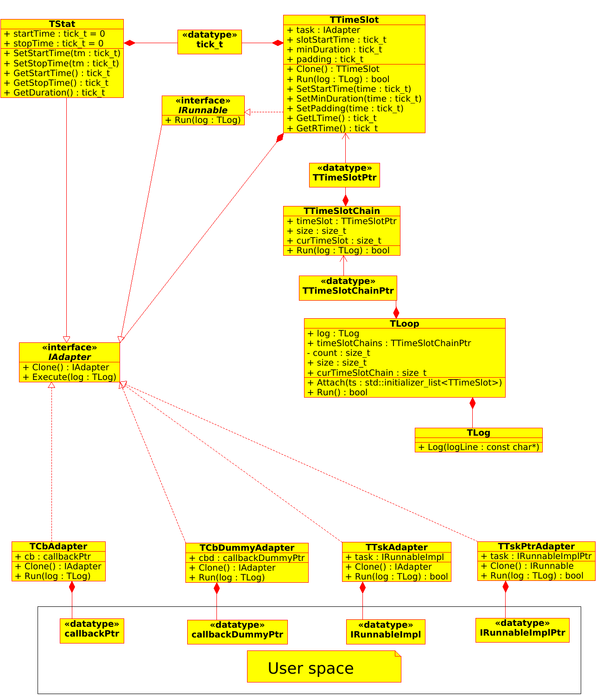

# MTLoop

## Multi Task Scheduler for Arduino

Вашему вниманию представляется мультизадачный планировщик для платформы Arduino - MTLoop, реализующий кооперативную многозадачность.

Цель разработки – создать планировщик, совместимый со всей гаммой Arduino подобных платформ.

Для достижения этой цели были приняты следующие архитектурные решения:

* Для управления задачами используем только цикл loop(), который есть во всех микроконтроллерах и не конфликтует с прерываниями.
* Время микроконтроллера разделяем на небольшие интервалы времени, называемые TTimeSlot. Тайм-слоты могут следовать один за другим, а могут и пересекаться, если принадлежат разным TTimeSlotChain (см ниже).
* Все программы должны быть реализованы в виде быстрых задач – классы, унаследованные от интерфейса TTask. Быстрая задача – это до 50мкс. Если задача медленная, она разбивается на подзадачи, которые “склеиваются” в цепочки с помощью TTimeSlotChain (см. ниже).
* Каждая задача привязывается к тайм-слоту. Один тайм-слот может содержать только одну задачу.
* Привязанная к тайм-слоту задача запускается только один раз в интервале времени, на который настроен TTimeSlot.
* Тайм-слоты с привязанными к ним задачами могут следовать последовательно. Для составления цепочек тайм-слотов служит TTimeSlotChain.
* Планировщик TLoop может управлять несколькими цепочками тайм-слотов (TTimeSlotChain) параллельно.
* Управление планировщику передается внутри функции loop путем вызова метода Tick().
* В планировщике предусмотрены элементарные средства отладки: TStat – сбор статистических данных и TLog – подсистема логирования

##UML диаграмма класссов

[В виде файла Umbrello](doc/uml.xmi)

##Clone & run tests

    mkdir ~/MTLoop
    git clone https://github.com/IlVin/MTLoop.git ~/MTLoop
    cd ~/MTLoop/bin
    cmake .. && make && ./MTLoop_ut.exe

